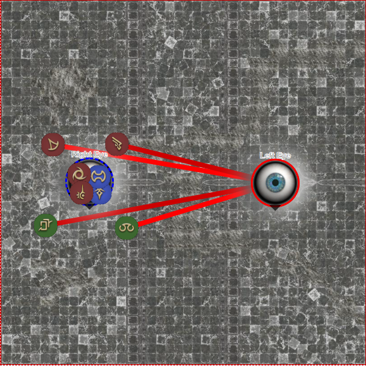

# Phase 3 - Left & Right Eye of Nidhogg
[Breakdown Video](https://www.youtube.com/watch?v=JcKf0TaZTmI)

[Toolbox matching above video, edited for our jobs](https://ff14.toolboxgaming.space/?id=801468030414561&preview=1)

## Mechanics
* **Nidhogg's Influence** - Duty Guage, acts as enrage.  At 100, Nidhogg touches down and wipes raid with Revenge of the Horde.
* **Soul of Devotion/Friendship** - Buffs that allow you to hit the eyes.  Lost on death.
* **Resentment** - AoE from Estinien (untargateable) that applies a bleed. No visible cast bar.
* **Claw/Fangboud** - Red/Blue Tethers, 4 of each. Passed on contact (rot style).  The red tether originates from the left eye and shares all damage taken with the eye.  Blue Tether conversely heals the right eye for all damage taken.
* **Bound And Determined** - 'Slippery' debuff for passing chains
* **Golden Orbs** - Deals stacked damage when popped. Grows one stage larger and then explodes lethally if not taken.
* **Blue Orbs** - Deals damage in a small area when popped. Also grows one stage larger before exploding lethally.
* **Mirage Dive** - Meteor Stream style divebombs that targets 2 random players with red tether. Leaves a piercing resist down debuff that will last through the next dive, but fall off for the one after.
* **Steep in Rage** - Heavy AoE Damage.  Both eyes cast in unison. Damage is subject to red and blue tether effects.

## Phase Resolution
### Timeline
* Soul of Devotion/Friendship
* Resentment
* Tethers go out, 4 red 4 blue
* Gold and Blue Orbs Spawn
* Mirage Dive x2
* Mirage Dive x2
* Mirage Dive x2
* Steep In Rage x2
* Enrage

### Strategy
Begin phase with party stacked South. Shortly after, two members will 'explode' spreading the devotion buffs.  Missing these buffs or dying will mean you are forfeit from dealing damage for the entire phase.

After obtaining buffs, Party will spread like below:

Essentially both 'melee' DPS and caster will go west to the Right Eye, and tanks and ranged dps will go east to the left eye.

Tethers will go out.  The inner players (tanks/melee) want to end up with a red tether and the outer players (healers/ranged) want to end up with a blue tether.  If you have the correct tether stay where you are. If you have an incorrect tether, then meet up in the middle. Since you can only pass to opposite tether and you gain a slippery debuff on passing, this will swap everyone to the correct tether.

After everyone has the correct tether, melees should position under the eyes and ranged should position near their blue orb, on the outer side closer to the gold orb.

When the gold orb grows 1 size, melees will move into and soak the the stack damage.  Once the orb is popped the ranged should move into the melees to trade tether colors. Shortly after, the blue orbs will grow in size and ranged, now with red tethers, should soak their individual orb.

After all orbs are soaked, the east party will switch over and move to the west.  All melees should now be placed under ther the Right Eye of nidhogg, with ranged in each corner at max melee-ish

Two red tether players will be struck. First pair of melees will move to those players to swap tethers, using.  Use rotational/e10orbs/heavensward counting to determine who takes 'clockwise' and 'counterclockwise' tether.  First dive targets should remember if they were the first or second and move into center.

Second set of divebombs will hit two more players. The other two melee will trade places the same way.

Third set of divebombs will hit two more players.  The first set of divebomb players will take the 'clockwise' and 'counterclockwise' tether matching whichever they were.

Shortly after the final set both eyes will begin casting Steep in Rage.  Party should be close to killing the Right Eye now and should finish it off before the cast goes off so that only 1 occurs.  Party will then switch targets to the other eye.

When Steep goes off the right eye will revive with a small amount of HP from tethers, but should be low enough that 1 or 2 players should be able to handle it.  If both eyes are dead before the guage fills then you will be sent back in time.